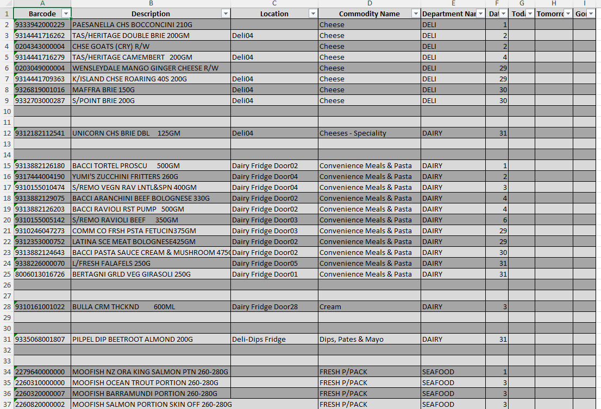

# retail-datecoding-automation


A Python automation script that processes raw retail scan data to identify products nearing expiry and generates structured, print-ready Excel reports. 
Previously, staff had to scan every single perishable items daily and manually mark them down. With this solution, a single weekly scan is sufficient, and the script 
produces an organized report highlighting products expiring that week — reducing manual effort and improving accuracy in markdowns, at the same time massively cutting down dump wastage costs.

---

##  FEATURES
- Renames columns for consistency (`Talker Count` → `Date`)
- Cleans and sorts data by Commodity Name → Date
- Inserts blank rows for readability between commodity groups
- Adds `Today / Tomorrow / Gone` placeholders
- Auto-adjusts Excel column widths
- Creates a styled Excel table for easy analysis, ready to print

---

## TECH STACK
Python
Pandas
OpenPyXL

---

##  PROJECT FILES
- `Datecoding_retial.py` → main automation script  
- `requirements.txt` → dependencies  
- `Datecoding_Input_Raw.xlsx` → sample raw input  
- `Datecoding_Output.xlsx` → sample processed output  

---

##  INSTALLATION
Clone the repo and install dependencies:
```bash
git clone https://github.com/Abhishek24J/retail-datecoding-automation.git
cd retail-datecoding-automation
pip install -r requirements.txt

---

## USAGE
Run the script with default filenames:
python Datecoding_Retail.py

---

## SAMPLE INPUT AND OUTPUT



