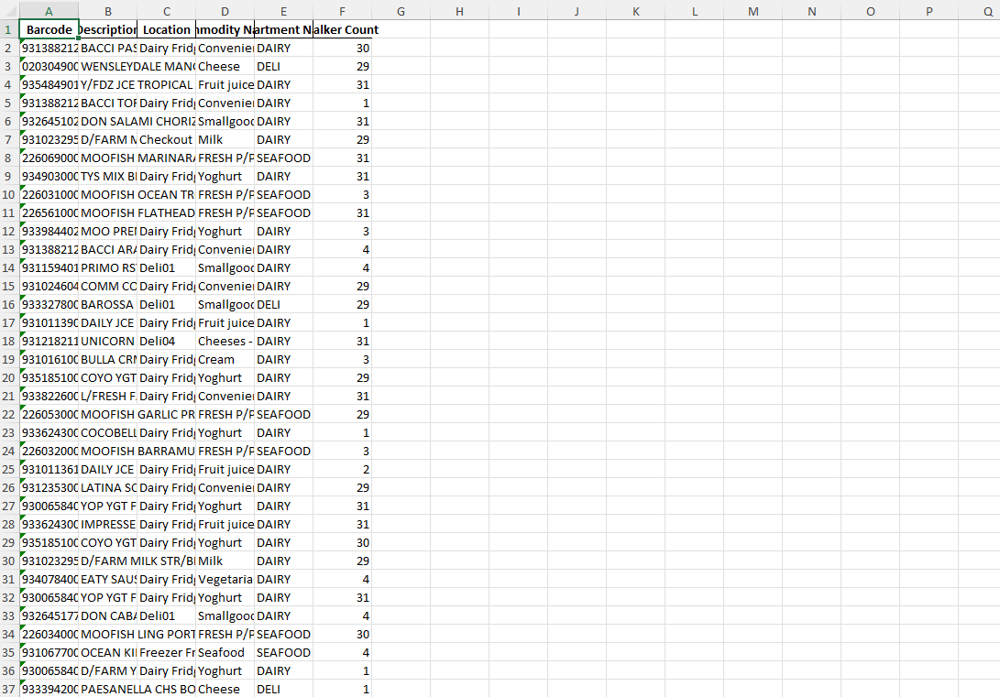

# retail-datecoding-automation

A Python automation script that processes raw retail scan data to identify products nearing expiry and generates structured, print-ready Excel reports.  

Previously, staff had to scan every single perishable item daily and manually mark them down. With this solution, a single weekly scan is sufficient, 
and the script produces an organized report highlighting products expiring that week, which any of the staff can refer to and markdown as required,
reducing manual effort, improving accuracy in markdowns, and massively cutting down dump wastage costs.

---

## ✨ Features
- Renames columns for consistency (`Talker Count` → `Date`)
- Cleans and sorts data by **Commodity Name → Date**
- Inserts blank rows for readability between commodity groups
- Adds `Today / Tomorrow / Gone` placeholders
- Auto-adjusts Excel column widths
- Creates a styled Excel table for easy analysis, ready to print

---

## 🛠 Tech Stack
- Python  
- Pandas  
- OpenPyXL  

---

## 📂 Project Files
- `Datecoding_retail.py` → main automation script  
- `requirements.txt` → dependencies  
- `Datecoding_Input.xlsx` → sample raw input  
- `Datecoding_Output.xlsx` → sample processed output  

---

## ⚙️ Installation
Clone the repo and install dependencies:

```bash
git clone https://github.com/Abhishek24J/retail-datecoding-automation.git
cd retail-datecoding-automation
pip install -r requirements.txt
```

---

## 🚀 Usage

Run the script with default filenames:

```
python Datecoding_retail.py
```

---

## 📊 Sample Input and Output

<p align="center"> <b>Raw Input (unorganized scan export)</b><br>
 </p>

<br>

<p align="center"> <b>Processed Report (auto-formatted, print-ready)</b><br> 
 </p>
